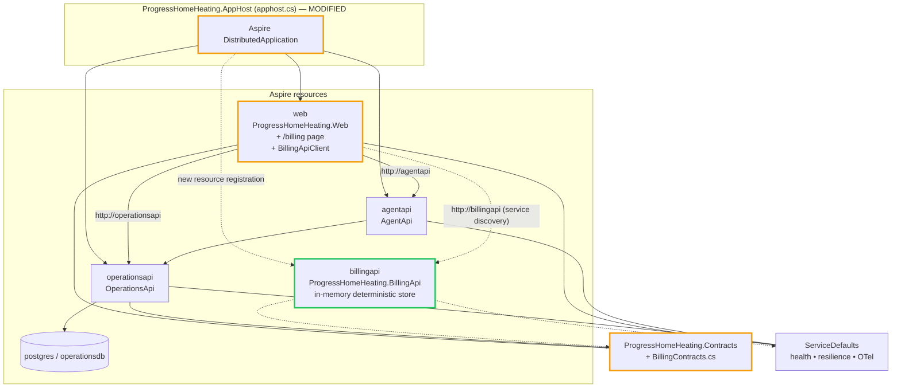
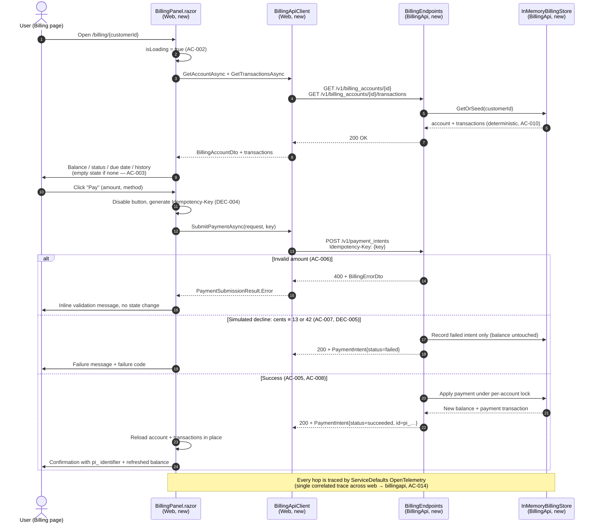

# Issue #4 — Customer Billing Page + Aspire-Orchestrated Faux Billing Service

## Overview

Add a **Billing** experience to the Progress Home Heating demo:

1. A new standalone microservice, `ProgressHomeHeating.BillingApi`, exposing a **Stripe-inspired**,
   provider-neutral REST API (`/v1/billing_accounts`, `/v1/payment_intents`) backed by an
   **in-memory, deterministically seeded** store — no external provider, no API keys, no network calls.
2. Shared DTOs in `ProgressHomeHeating.Contracts/BillingContracts.cs`.
3. A new Blazor page `/billing` in `ProgressHomeHeating.Web` with a typed `BillingApiClient`,
   a nav entry, and explicit loading / empty / error / success / failure states.
4. Aspire wiring in `ProgressHomeHeating.AppHost/apphost.cs` so `web` reaches `billingapi`
   purely through service discovery (`http://billingapi`).
5. Two new xUnit v3 test projects (API tests via `WebApplicationFactory`, component tests via bUnit).

## Key design decisions (full reasoning in `research.md`)

| ID | Decision | One-line rationale |
|----|----------|--------------------|
| DEC-001 | **In-memory deterministic store**, not a new Postgres database | Repeatable across restarts (AC-010), no migrations, no startup cost (NFR startup performance) |
| DEC-002 | Billing account data is **derived from the customer GUID** (`seed = hash(customerId)`) | Zero coupling to `OperationsApi` persistence, yet every customer always gets the same balance/history |
| DEC-003 | "Current customer" = **explicit selector + route parameter** `/billing/{customerId:guid}` | No auth/session model exists; avoids scope creep into authentication |
| DEC-004 | **Stripe-style `Idempotency-Key` header** + in-flight button disable | Prevents duplicate payments on double-click/retry |
| DEC-005 | Simulated failures triggered by **deterministic magic cent values** (`…13` = declined, `…42` = processing error) | Reliably testable and demo-friendly; no randomness |
| DEC-006 | Validation: min **$1.00**, overpayment **rejected**, partial payments **allowed**, USD only | Explicit, testable bounds for AC-006 |
| DEC-007 | AppHost uses `.WithReference(billingApi)` **without** `.WaitFor(...)` | Billing outage must not block Web startup or the Dashboard/Customers/Scheduler pages |
| DEC-008 | Billing UI uses **plain Bootstrap markup** (no Telerik) in a testable `BillingPanel` child component | Enables bUnit component tests without Telerik root component/licensing in the test host |
| DEC-009 | `global.json` gains `"test": { "runner": "Microsoft.Testing.Platform" }` | **Required** on the .NET 10 SDK — VSTest targets fail; verified empirically |

## Architecture — component view

**Legend** — green outline: new component · amber outline: modified existing component ·
dashed arrow: new relationship introduced by this issue · solid arrow: pre-existing relationship.

## End-to-end payment flow — sequence view

## Phases

| Phase | Title | Depends on | Parallelizable with |
|-------|-------|-----------|---------------------|
| PHASE-1 | Shared billing contracts | — | — |
| PHASE-2 | BillingApi service implementation | PHASE-1 | — |
| PHASE-3 | Aspire AppHost + solution wiring | PHASE-2 | PHASE-4 |
| PHASE-4 | Web Billing page + typed client | PHASE-1, PHASE-2 | PHASE-3 |
| PHASE-5 | Automated tests, docs, end-to-end verification | PHASE-2, PHASE-3, PHASE-4 | — |

Detailed, literal instructions live in `phase_1.md` … `phase_5.md`.
Progress tracking lives in `tasks.md`.

## Files created / modified

| File | Action |
|------|--------|
| `ProgressHomeHeating.Contracts/BillingContracts.cs` | **new** |
| `ProgressHomeHeating.BillingApi/**` (csproj, Program.cs, Billing/, Endpoints/, Properties/, appsettings*, .http) | **new project** |
| `ProgressHomeHeating.AppHost/apphost.cs` | modified — register `billingapi`, reference from `web` |
| `ProgressHomeHeating.slnx` | modified — add 3 projects |
| `global.json` | modified — MTP test runner opt-in |
| `ProgressHomeHeating.Web/Program.cs` | modified — register `IBillingApiClient` HTTP client |
| `ProgressHomeHeating.Web/Services/BillingApiClient.cs` | **new** |
| `ProgressHomeHeating.Web/Components/Pages/Billing.razor` | **new** |
| `ProgressHomeHeating.Web/Components/Billing/BillingPanel.razor` | **new** |
| `ProgressHomeHeating.Web/Components/Layout/NavMenu.razor` | modified — Billing nav entry |
| `ProgressHomeHeating.BillingApi.Tests/**` | **new project** |
| `ProgressHomeHeating.Web.Tests/**` | **new project** |
| `README.md` (repo root) | modified — document billing service + page |

## Acceptance criteria coverage map

| AC | Covered by |
|----|-----------|
| AC-001 | PHASE-4 (TASK-4.3, TASK-4.4), PHASE-5 (TASK-5.6) |
| AC-002 | PHASE-4 (TASK-4.4), PHASE-5 (TASK-5.6) |
| AC-003 | PHASE-2 (TASK-2.4), PHASE-4 (TASK-4.4), PHASE-5 (TASK-5.6) |
| AC-004 | PHASE-4 (TASK-4.2, TASK-4.4), PHASE-5 (TASK-5.6) |
| AC-005 | PHASE-2 (TASK-2.6), PHASE-4 (TASK-4.4), PHASE-5 (TASK-5.5, TASK-5.6) |
| AC-006 | PHASE-2 (TASK-2.5), PHASE-4 (TASK-4.4), PHASE-5 (TASK-5.5, TASK-5.6) |
| AC-007 | PHASE-2 (TASK-2.5, TASK-2.6), PHASE-5 (TASK-5.5, TASK-5.6) |
| AC-008 | PHASE-4 (TASK-4.4), PHASE-5 (TASK-5.6) |
| AC-009 | PHASE-2 (TASK-2.7), PHASE-5 (TASK-5.5) |
| AC-010 | PHASE-2 (TASK-2.4), PHASE-5 (TASK-5.4) |
| AC-011 | PHASE-2 (TASK-2.1, TASK-2.8), PHASE-5 (TASK-5.8) |
| AC-012 | PHASE-3 (TASK-3.2), PHASE-4 (TASK-4.1), PHASE-5 (TASK-5.8) |
| AC-013 | PHASE-2 (TASK-2.8), PHASE-5 (TASK-5.8) |
| AC-014 | PHASE-2 (TASK-2.8, TASK-2.9), PHASE-5 (TASK-5.8) |
| AC-015 | PHASE-5 (TASK-5.4, TASK-5.5, TASK-5.6, TASK-5.7) |
| AC-016 | PHASE-3 (TASK-3.3), PHASE-5 (TASK-5.8) |
