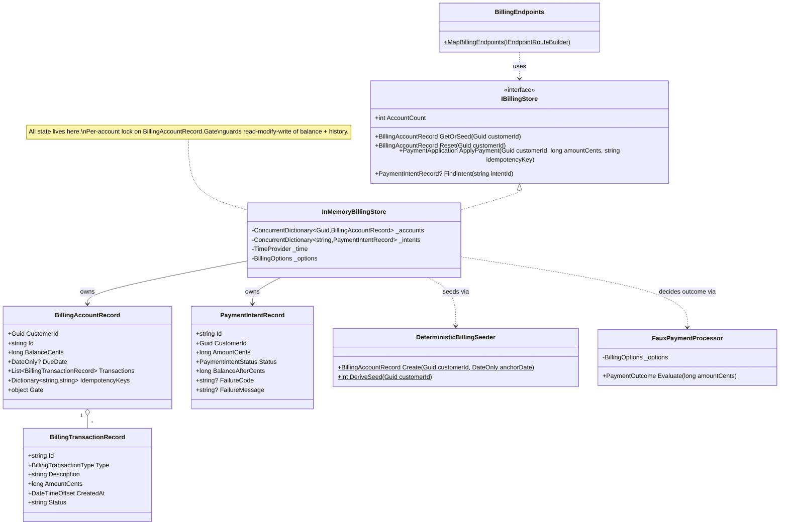

# PHASE-2 — `ProgressHomeHeating.BillingApi` Service

## Goal

Create the faux billing microservice: a new `net10.0` minimal-API project with a deterministic
in-memory store, a faux payment processor, Stripe-inspired endpoints, ServiceDefaults integration,
and a billing-specific health check and activity source.

## Dependencies

- **Depends on:** PHASE-1 (all types in `BillingContracts.cs` must exist).
- **Blocks:** PHASE-3, PHASE-4, PHASE-5.

## Domain model (class view)



All types in this diagram are **new** (the whole project is new), so no change-annotation colours are used.

## Tasks

### TASK-2.1 — Create the project file

Create `ProgressHomeHeating.BillingApi/ProgressHomeHeating.BillingApi.csproj`:

```xml
<Project Sdk="Microsoft.NET.Sdk.Web">

  <PropertyGroup>
    <TargetFramework>net10.0</TargetFramework>
    <Nullable>enable</Nullable>
    <ImplicitUsings>enable</ImplicitUsings>
  </PropertyGroup>

  <ItemGroup>
    <PackageReference Include="Microsoft.AspNetCore.OpenApi" Version="10.0.11" />
    <PackageReference Include="Bogus" Version="35.6.5" />
  </ItemGroup>

  <ItemGroup>
    <ProjectReference Include="..\ServiceDefaults\ServiceDefaults.csproj" />
    <ProjectReference Include="..\ProgressHomeHeating.Contracts\ProgressHomeHeating.Contracts.csproj" />
  </ItemGroup>

  <ItemGroup>
    <InternalsVisibleTo Include="ProgressHomeHeating.BillingApi.Tests" />
  </ItemGroup>

</Project>
```

There must be **no** package reference to any payment SDK, HTTP SDK, or database provider (AC-011).

### TASK-2.2 — Create configuration and launch files

Create `ProgressHomeHeating.BillingApi/appsettings.json`:

```json
{
  "Logging": {
    "LogLevel": {
      "Default": "Information",
      "Microsoft.AspNetCore": "Warning"
    }
  },
  "AllowedHosts": "*",
  "Billing": {
    "DeclineCents": 13,
    "ProcessingErrorCents": 42,
    "SeedAnchorDate": null
  }
}
```

Create `ProgressHomeHeating.BillingApi/appsettings.Development.json`:

```json
{
  "Logging": {
    "LogLevel": {
      "Default": "Information",
      "Microsoft.AspNetCore": "Warning"
    }
  }
}
```

Create `ProgressHomeHeating.BillingApi/Properties/launchSettings.json`:

```json
{
  "$schema": "https://json.schemastore.org/launchsettings.json",
  "profiles": {
    "http": {
      "commandName": "Project",
      "dotnetRunMessages": true,
      "launchBrowser": false,
      "applicationUrl": "http://localhost:5311",
      "environmentVariables": {
        "ASPNETCORE_ENVIRONMENT": "Development"
      }
    },
    "https": {
      "commandName": "Project",
      "dotnetRunMessages": true,
      "launchBrowser": false,
      "applicationUrl": "https://localhost:7311;http://localhost:5311",
      "environmentVariables": {
        "ASPNETCORE_ENVIRONMENT": "Development"
      }
    }
  }
}
```

### TASK-2.3 — Create options, records, and telemetry types

Create `ProgressHomeHeating.BillingApi/Billing/BillingOptions.cs`:

```csharp
namespace ProgressHomeHeating.BillingApi.Billing;

public sealed class BillingOptions
{
    public const string SectionName = "Billing";

    // Payments whose cent remainder equals this value are deterministically declined.
    public int DeclineCents { get; set; } = 13;

    // Payments whose cent remainder equals this value deterministically fail with a processing error.
    public int ProcessingErrorCents { get; set; } = 42;

    // When set, seeded dates are generated relative to this date instead of today (test determinism).
    public DateOnly? SeedAnchorDate { get; set; }
}
```

Create `ProgressHomeHeating.BillingApi/Billing/BillingRecords.cs`:

```csharp
using ProgressHomeHeating.Contracts;

namespace ProgressHomeHeating.BillingApi.Billing;

public sealed class BillingAccountRecord
{
    public required string Id { get; init; }
    public required Guid CustomerId { get; init; }
    public long BalanceCents { get; set; }
    public DateOnly? DueDate { get; set; }
    public List<BillingTransactionRecord> Transactions { get; } = [];
    public Dictionary<string, string> IdempotencyKeys { get; } = [];
    public object Gate { get; } = new();
}

public sealed class BillingTransactionRecord
{
    public required string Id { get; init; }
    public required BillingTransactionType Type { get; init; }
    public required string Description { get; init; }
    public required long AmountCents { get; init; }
    public required DateTimeOffset CreatedAt { get; init; }
    public required string Status { get; init; }
}

public sealed class PaymentIntentRecord
{
    public required string Id { get; init; }
    public required Guid CustomerId { get; init; }
    public required long AmountCents { get; init; }
    public required PaymentIntentStatus Status { get; init; }
    public required DateTimeOffset CreatedAt { get; init; }
    public required long BalanceAfterCents { get; init; }
    public string? FailureCode { get; init; }
    public string? FailureMessage { get; init; }
}

public sealed record PaymentApplication(PaymentIntentRecord Intent, bool Replayed);

public sealed record PaymentOutcome(bool Succeeded, string? FailureCode, string? FailureMessage);
```

Create `ProgressHomeHeating.BillingApi/Billing/BillingTelemetry.cs`:

```csharp
using System.Diagnostics;

namespace ProgressHomeHeating.BillingApi.Billing;

public static class BillingTelemetry
{
    public const string ActivitySourceName = "ProgressHomeHeating.Billing";

    public static readonly ActivitySource Source = new(ActivitySourceName);
}
```

### TASK-2.4 — Create the deterministic seeder

Create `ProgressHomeHeating.BillingApi/Billing/DeterministicBillingSeeder.cs`:

```csharp
using Bogus;
using ProgressHomeHeating.Contracts;

namespace ProgressHomeHeating.BillingApi.Billing;

public static class DeterministicBillingSeeder
{
    // Accounts whose derived seed satisfies this rule are seeded with no history and a zero balance,
    // so the Billing page's empty state is reachable deterministically (AC-003).
    public const int EmptyAccountModulus = 7;

    private static readonly string[] InvoiceDescriptions =
    [
        "Heating oil delivery",
        "Automatic delivery top-up",
        "Annual service plan",
        "Emergency delivery surcharge",
        "Burner maintenance visit"
    ];

    public static int DeriveSeed(Guid customerId)
    {
        var hash = 17;
        foreach (var b in customerId.ToByteArray())
        {
            hash = unchecked((hash * 31) + b);
        }

        return hash & 0x7FFFFFFF;
    }

    public static bool IsEmptyAccount(Guid customerId) =>
        DeriveSeed(customerId) % EmptyAccountModulus == 0;

    public static BillingAccountRecord Create(Guid customerId, DateOnly anchorDate)
    {
        var seed = DeriveSeed(customerId);
        var random = new Randomizer(seed);

        var account = new BillingAccountRecord
        {
            Id = $"acct_{customerId:N}",
            CustomerId = customerId
        };

        if (seed % EmptyAccountModulus == 0)
        {
            account.BalanceCents = 0;
            account.DueDate = null;
            return account;
        }

        var invoiceCount = random.Int(2, 6);
        var anchorUtc = new DateTimeOffset(anchorDate.ToDateTime(TimeOnly.MinValue), TimeSpan.Zero);
        var balance = 0L;

        for (var i = invoiceCount; i >= 1; i--)
        {
            var amount = random.Int(9_000, 68_000);
            var createdAt = anchorUtc.AddDays(-30 * i);
            var isPaid = i > 1;

            account.Transactions.Add(new BillingTransactionRecord
            {
                Id = $"txn_{DeterministicGuid(seed, i * 2):N}",
                Type = BillingTransactionType.Invoice,
                Description = $"{InvoiceDescriptions[random.Int(0, InvoiceDescriptions.Length - 1)]} — {random.Int(75, 300)} gal",
                AmountCents = amount,
                CreatedAt = createdAt,
                Status = isPaid ? "paid" : "open"
            });

            if (isPaid)
            {
                account.Transactions.Add(new BillingTransactionRecord
                {
                    Id = $"txn_{DeterministicGuid(seed, (i * 2) + 1):N}",
                    Type = BillingTransactionType.Payment,
                    Description = "Payment received — thank you",
                    AmountCents = -amount,
                    CreatedAt = createdAt.AddDays(random.Int(3, 12)),
                    Status = "succeeded"
                });
            }
            else
            {
                balance = amount;
            }
        }

        account.BalanceCents = balance;
        account.DueDate = anchorDate.AddDays(random.Int(-6, 21));

        account.Transactions.Sort((a, b) => b.CreatedAt.CompareTo(a.CreatedAt));
        return account;
    }

    private static Guid DeterministicGuid(int seed, int ordinal)
    {
        var bytes = new byte[16];
        BitConverter.GetBytes(seed).CopyTo(bytes, 0);
        BitConverter.GetBytes(ordinal).CopyTo(bytes, 4);
        BitConverter.GetBytes(seed ^ ordinal).CopyTo(bytes, 8);
        BitConverter.GetBytes(unchecked(seed * 31) + ordinal).CopyTo(bytes, 12);
        return new Guid(bytes);
    }
}
```

Requirements this must satisfy, verifiable by inspection:

- No call to `DateTime.Now`, `DateTime.UtcNow`, `Guid.NewGuid()`, or an unseeded `Random`.
- Every value derives from `customerId` and `anchorDate` only (AC-010).

### TASK-2.5 — Create the faux payment processor

Create `ProgressHomeHeating.BillingApi/Billing/FauxPaymentProcessor.cs`:

```csharp
using Microsoft.Extensions.Options;
using ProgressHomeHeating.Contracts;

namespace ProgressHomeHeating.BillingApi.Billing;

public sealed class FauxPaymentProcessor(IOptions<BillingOptions> options)
{
    private readonly BillingOptions _options = options.Value;

    // Deterministic, provider-style outcomes. No randomness, no external call (AC-011, NFR determinism).
    public PaymentOutcome Evaluate(long amountCents)
    {
        var cents = (int)(amountCents % 100);

        if (cents == _options.DeclineCents)
        {
            return new PaymentOutcome(false, BillingErrorCodes.CardDeclined,
                "Your payment method was declined by the issuing bank.");
        }

        if (cents == _options.ProcessingErrorCents)
        {
            return new PaymentOutcome(false, BillingErrorCodes.ProcessingError,
                "The payment could not be processed. No funds were moved.");
        }

        return new PaymentOutcome(true, null, null);
    }

    // Returns null when the request is valid; otherwise the validation error to return as HTTP 400.
    public static BillingErrorDto? Validate(CreatePaymentIntentRequest request, long balanceCents)
    {
        if (request.AmountCents <= 0)
        {
            return new BillingErrorDto(BillingErrorCodes.AmountInvalid,
                "Payment amount must be greater than zero.", "amountCents");
        }

        if (request.AmountCents < BillingConstants.MinimumPaymentCents)
        {
            return new BillingErrorDto(BillingErrorCodes.AmountBelowMinimum,
                "The minimum payment is $1.00.", "amountCents");
        }

        if (request.AmountCents > balanceCents)
        {
            return new BillingErrorDto(BillingErrorCodes.AmountExceedsBalance,
                "Payment amount cannot exceed the outstanding balance.", "amountCents");
        }

        if (!string.Equals(request.Currency, BillingConstants.Currency, StringComparison.OrdinalIgnoreCase))
        {
            return new BillingErrorDto(BillingErrorCodes.CurrencyUnsupported,
                "Only USD payments are supported.", "currency");
        }

        if (!BillingPaymentMethods.All.Contains(request.PaymentMethod, StringComparer.OrdinalIgnoreCase))
        {
            return new BillingErrorDto(BillingErrorCodes.PaymentMethodUnsupported,
                "Supported payment methods are 'card' and 'bank_account'.", "paymentMethod");
        }

        return null;
    }
}
```

### TASK-2.6 — Create the store

Create `ProgressHomeHeating.BillingApi/Billing/BillingStore.cs`:

```csharp
using System.Collections.Concurrent;
using Microsoft.Extensions.Options;
using ProgressHomeHeating.Contracts;

namespace ProgressHomeHeating.BillingApi.Billing;

public interface IBillingStore
{
    BillingAccountRecord GetOrSeed(Guid customerId);
    BillingAccountRecord Reset(Guid customerId);
    PaymentApplication ApplyPayment(CreatePaymentIntentRequest request, string? idempotencyKey);
    PaymentIntentRecord? FindIntent(string intentId);
    int AccountCount { get; }
}

public sealed class InMemoryBillingStore(
    IOptions<BillingOptions> options,
    FauxPaymentProcessor processor,
    TimeProvider timeProvider,
    ILogger<InMemoryBillingStore> logger) : IBillingStore
{
    private readonly ConcurrentDictionary<Guid, BillingAccountRecord> _accounts = new();
    private readonly ConcurrentDictionary<string, PaymentIntentRecord> _intents = new();
    private readonly BillingOptions _options = options.Value;

    public int AccountCount => _accounts.Count;

    private DateOnly AnchorDate =>
        _options.SeedAnchorDate ?? DateOnly.FromDateTime(timeProvider.GetUtcNow().UtcDateTime);

    public BillingAccountRecord GetOrSeed(Guid customerId) =>
        _accounts.GetOrAdd(customerId, id =>
        {
            logger.LogInformation("Seeding deterministic billing account for customer {CustomerId}", id);
            return DeterministicBillingSeeder.Create(id, AnchorDate);
        });

    public BillingAccountRecord Reset(Guid customerId)
    {
        var seeded = DeterministicBillingSeeder.Create(customerId, AnchorDate);
        _accounts[customerId] = seeded;
        logger.LogInformation("Reset billing account for customer {CustomerId}", customerId);
        return seeded;
    }

    public PaymentIntentRecord? FindIntent(string intentId) =>
        _intents.TryGetValue(intentId, out var intent) ? intent : null;

    public PaymentApplication ApplyPayment(CreatePaymentIntentRequest request, string? idempotencyKey)
    {
        var account = GetOrSeed(request.CustomerId);

        lock (account.Gate)
        {
            if (idempotencyKey is not null
                && account.IdempotencyKeys.TryGetValue(idempotencyKey, out var existingId)
                && _intents.TryGetValue(existingId, out var existing))
            {
                logger.LogInformation(
                    "Replaying payment intent {PaymentIntentId} for idempotency key {IdempotencyKey}",
                    existingId, idempotencyKey);
                return new PaymentApplication(existing, Replayed: true);
            }

            var outcome = processor.Evaluate(request.AmountCents);
            var now = timeProvider.GetUtcNow();
            var intentId = $"pi_{Guid.CreateVersion7():N}";

            if (outcome.Succeeded)
            {
                account.BalanceCents -= request.AmountCents;
                account.Transactions.Insert(0, new BillingTransactionRecord
                {
                    Id = $"txn_{Guid.CreateVersion7():N}",
                    Type = BillingTransactionType.Payment,
                    Description = "Payment received — thank you",
                    AmountCents = -request.AmountCents,
                    CreatedAt = now,
                    Status = "succeeded"
                });

                if (account.BalanceCents == 0)
                {
                    account.DueDate = null;
                }
            }

            var intent = new PaymentIntentRecord
            {
                Id = intentId,
                CustomerId = request.CustomerId,
                AmountCents = request.AmountCents,
                Status = outcome.Succeeded ? PaymentIntentStatus.Succeeded : PaymentIntentStatus.Failed,
                CreatedAt = now,
                BalanceAfterCents = account.BalanceCents,
                FailureCode = outcome.FailureCode,
                FailureMessage = outcome.FailureMessage
            };

            _intents[intentId] = intent;

            if (idempotencyKey is not null)
            {
                account.IdempotencyKeys[idempotencyKey] = intentId;
            }

            logger.LogInformation(
                "Payment intent {PaymentIntentId} for customer {CustomerId} completed with status {Status}",
                intent.Id, request.CustomerId, intent.Status);

            return new PaymentApplication(intent, Replayed: false);
        }
    }
}
```

Behavioural requirements verified in PHASE-5:

- A failed outcome **must not** change `BalanceCents` nor add a transaction (AC-007).
- The balance mutation and history insert happen inside one `lock (account.Gate)` block
  (concurrent-update risk from the issue).

### TASK-2.7 — Create the mapping helpers and endpoints

Create `ProgressHomeHeating.BillingApi/Billing/MappingExtensions.cs`:

```csharp
using ProgressHomeHeating.Contracts;

namespace ProgressHomeHeating.BillingApi.Billing;

public static class MappingExtensions
{
    public static BillingAccountDto ToDto(this BillingAccountRecord account, DateOnly today, DateTimeOffset asOf) =>
        new(account.Id,
            account.CustomerId,
            BillingConstants.Currency,
            account.BalanceCents,
            ResolveStatus(account, today),
            account.DueDate,
            asOf);

    public static BillingTransactionDto ToDto(this BillingTransactionRecord transaction, Guid customerId) =>
        new(transaction.Id,
            customerId,
            transaction.Type,
            transaction.Description,
            transaction.AmountCents,
            BillingConstants.Currency,
            transaction.CreatedAt,
            transaction.Status);

    public static PaymentIntentDto ToDto(this PaymentIntentRecord intent) =>
        new(intent.Id,
            intent.CustomerId,
            intent.AmountCents,
            BillingConstants.Currency,
            intent.Status,
            intent.CreatedAt,
            intent.BalanceAfterCents,
            intent.FailureCode,
            intent.FailureMessage);

    private static BillingAccountStatus ResolveStatus(BillingAccountRecord account, DateOnly today)
    {
        if (account.BalanceCents <= 0) return BillingAccountStatus.PaidInFull;
        if (account.DueDate is null) return BillingAccountStatus.Current;
        if (account.DueDate < today) return BillingAccountStatus.PastDue;
        if (account.DueDate.Value.DayNumber - today.DayNumber <= 7) return BillingAccountStatus.DueSoon;
        return BillingAccountStatus.Current;
    }
}
```

Create `ProgressHomeHeating.BillingApi/Endpoints/BillingEndpoints.cs`:

```csharp
using ProgressHomeHeating.BillingApi.Billing;
using ProgressHomeHeating.Contracts;

namespace ProgressHomeHeating.BillingApi.Endpoints;

public static class BillingEndpoints
{
    public static void MapBillingEndpoints(this IEndpointRouteBuilder app)
    {
        var accounts = app.MapGroup("/v1/billing_accounts").WithTags("BillingAccounts");

        accounts.MapGet("/{customerId:guid}", (Guid customerId, IBillingStore store, TimeProvider time) =>
        {
            var now = time.GetUtcNow();
            var account = store.GetOrSeed(customerId);
            return Results.Ok(account.ToDto(DateOnly.FromDateTime(now.UtcDateTime), now));
        });

        accounts.MapGet("/{customerId:guid}/transactions", (Guid customerId, int? limit, IBillingStore store) =>
        {
            var take = limit ?? BillingConstants.DefaultTransactionLimit;
            if (take < 1 || take > BillingConstants.MaxTransactionLimit)
            {
                return Results.BadRequest(new BillingErrorDto(
                    BillingErrorCodes.LimitInvalid,
                    $"limit must be between 1 and {BillingConstants.MaxTransactionLimit}.",
                    "limit"));
            }

            var account = store.GetOrSeed(customerId);
            List<BillingTransactionRecord> snapshot;
            lock (account.Gate)
            {
                snapshot = [.. account.Transactions];
            }

            var page = snapshot.Take(take).Select(t => t.ToDto(customerId)).ToList();
            return Results.Ok(new BillingTransactionListDto(page, snapshot.Count > take));
        });

        accounts.MapPost("/{customerId:guid}/reset", (Guid customerId, IBillingStore store, TimeProvider time) =>
        {
            var now = time.GetUtcNow();
            var account = store.Reset(customerId);
            return Results.Ok(account.ToDto(DateOnly.FromDateTime(now.UtcDateTime), now));
        });

        var intents = app.MapGroup("/v1/payment_intents").WithTags("PaymentIntents");

        intents.MapPost("/", (CreatePaymentIntentRequest request, HttpContext http, IBillingStore store) =>
        {
            using var activity = BillingTelemetry.Source.StartActivity("billing.create_payment_intent");
            activity?.SetTag("billing.customer_id", request.CustomerId);
            activity?.SetTag("billing.amount_cents", request.AmountCents);

            var account = store.GetOrSeed(request.CustomerId);
            var validationError = FauxPaymentProcessor.Validate(request, account.BalanceCents);
            if (validationError is not null)
            {
                activity?.SetTag("billing.result", validationError.Code);
                return Results.BadRequest(validationError);
            }

            var key = http.Request.Headers[BillingConstants.IdempotencyKeyHeader].FirstOrDefault();
            var application = store.ApplyPayment(request, string.IsNullOrWhiteSpace(key) ? null : key);

            activity?.SetTag("billing.result", application.Intent.Status.ToString());
            activity?.SetTag("billing.idempotency_replayed", application.Replayed);

            if (application.Replayed)
            {
                http.Response.Headers[BillingConstants.IdempotencyReplayedHeader] = "true";
            }

            return Results.Ok(application.Intent.ToDto());
        });

        intents.MapGet("/{id}", (string id, IBillingStore store) =>
            store.FindIntent(id) is { } intent ? Results.Ok(intent.ToDto()) : Results.NotFound());
    }
}
```

> **Note on HTTP semantics (DEC-005):** a simulated decline returns **200 OK** with
> `PaymentIntentDto.Status == Failed`. Only request-validation problems return **400** with a
> `BillingErrorDto`. This keeps AC-006 and AC-007 distinguishable by status code.

### TASK-2.8 — Create `Program.cs` with ServiceDefaults, health check, and telemetry

Create `ProgressHomeHeating.BillingApi/Billing/BillingStoreHealthCheck.cs`:

```csharp
using Microsoft.Extensions.Diagnostics.HealthChecks;

namespace ProgressHomeHeating.BillingApi.Billing;

public sealed class BillingStoreHealthCheck(IBillingStore store) : IHealthCheck
{
    public Task<HealthCheckResult> CheckHealthAsync(
        HealthCheckContext context, CancellationToken cancellationToken = default) =>
        Task.FromResult(HealthCheckResult.Healthy(
            "Billing store ready.",
            new Dictionary<string, object> { ["seededAccounts"] = store.AccountCount }));
}
```

Create `ProgressHomeHeating.BillingApi/Program.cs`:

```csharp
using ProgressHomeHeating.BillingApi.Billing;
using ProgressHomeHeating.BillingApi.Endpoints;

var builder = WebApplication.CreateBuilder(args);

builder.AddServiceDefaults();

builder.Services.AddOpenApi();

builder.Services.Configure<BillingOptions>(builder.Configuration.GetSection(BillingOptions.SectionName));
builder.Services.AddSingleton(TimeProvider.System);
builder.Services.AddSingleton<FauxPaymentProcessor>();
builder.Services.AddSingleton<IBillingStore, InMemoryBillingStore>();

builder.Services.AddHealthChecks()
    .AddCheck<BillingStoreHealthCheck>("billing-store");

builder.Services.AddOpenTelemetry()
    .WithTracing(tracing => tracing.AddSource(BillingTelemetry.ActivitySourceName));

var app = builder.Build();

app.MapDefaultEndpoints();

if (app.Environment.IsDevelopment())
{
    app.MapOpenApi();
}

app.UseHttpsRedirection();

app.MapBillingEndpoints();

app.Run();

// Exposed so ProgressHomeHeating.BillingApi.Tests can use WebApplicationFactory<Program>.
public partial class Program;
```

Required `using` for `AddOpenTelemetry`: add `using OpenTelemetry;` and
`using OpenTelemetry.Trace;` at the top of `Program.cs` if the build reports missing extension methods.

### TASK-2.9 — Create the manual-request `.http` file

Create `ProgressHomeHeating.BillingApi/ProgressHomeHeating.BillingApi.http`:

```
@host = http://localhost:5311
@customerId = 00000000-0000-0000-0000-000000000001

### Retrieve billing account (balance, status, due date)
GET {{host}}/v1/billing_accounts/{{customerId}}
Accept: application/json

### List transactions
GET {{host}}/v1/billing_accounts/{{customerId}}/transactions?limit=20
Accept: application/json

### Submit a successful payment ($25.00)
POST {{host}}/v1/payment_intents
Content-Type: application/json
Idempotency-Key: 11111111-1111-1111-1111-111111111111

{
  "customerId": "{{customerId}}",
  "amountCents": 2500,
  "currency": "usd",
  "paymentMethod": "card"
}

### Simulated decline — amount ends in .13
POST {{host}}/v1/payment_intents
Content-Type: application/json

{
  "customerId": "{{customerId}}",
  "amountCents": 2513,
  "currency": "usd",
  "paymentMethod": "card"
}

### Validation failure — zero amount
POST {{host}}/v1/payment_intents
Content-Type: application/json

{
  "customerId": "{{customerId}}",
  "amountCents": 0,
  "currency": "usd",
  "paymentMethod": "card"
}

### Reset one account to its deterministic seed state
POST {{host}}/v1/billing_accounts/{{customerId}}/reset

### Health
GET {{host}}/health
```

### TASK-2.10 — Build the service

```bash
dotnet build ProgressHomeHeating.BillingApi/ProgressHomeHeating.BillingApi.csproj
```

## Acceptance criteria for PHASE-2

- [ ] `dotnet build ProgressHomeHeating.BillingApi/ProgressHomeHeating.BillingApi.csproj` exits `0` with `0 Error(s)`.
- [ ] `grep -R "Stripe\|HttpClient\|Npgsql\|ApiKey" ProgressHomeHeating.BillingApi --include=*.cs` returns no matches (AC-011).
- [ ] `grep -R "DateTime.Now\|DateTime.UtcNow\|Guid.NewGuid" ProgressHomeHeating.BillingApi/Billing/DeterministicBillingSeeder.cs` returns no matches (AC-010).
- [ ] `Program.cs` contains both `builder.AddServiceDefaults();` and `app.MapDefaultEndpoints();` (AC-013, AC-014).
- [ ] Running `dotnet run --project ProgressHomeHeating.BillingApi` and calling
      `curl -s http://localhost:5311/v1/billing_accounts/00000000-0000-0000-0000-000000000001`
      returns HTTP 200 with a JSON body containing `balanceCents` (AC-009).
- [ ] `curl -s http://localhost:5311/health` returns `Healthy` (AC-013).

## Validation commands

```bash
dotnet build ProgressHomeHeating.BillingApi/ProgressHomeHeating.BillingApi.csproj
dotnet run --project ProgressHomeHeating.BillingApi &
sleep 8
curl -i http://localhost:5311/v1/billing_accounts/00000000-0000-0000-0000-000000000001
curl -i http://localhost:5311/v1/billing_accounts/00000000-0000-0000-0000-000000000001/transactions
curl -i -X POST http://localhost:5311/v1/payment_intents \
  -H 'Content-Type: application/json' \
  -d '{"customerId":"00000000-0000-0000-0000-000000000001","amountCents":2500,"currency":"usd","paymentMethod":"card"}'
curl -i http://localhost:5311/health
```

Stop the background process with `kill <PID>` when finished.
