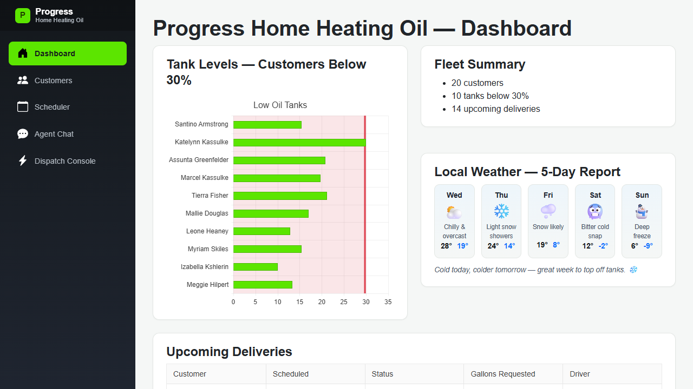

# Progress Home Heating Oil

A demo distributed application for a residential heating oil delivery company, built with
.NET Aspire, Blazor Server, and an AI dispatch agent backed by Azure OpenAI.



## What's here

| Project | Purpose |
|---|---|
| `ProgressHomeHeating.AppHost` | .NET Aspire app host (file-based `apphost.cs`) — orchestrates Postgres, the APIs, and the web frontend |
| `ProgressHomeHeating.Web` | Blazor Server frontend (Telerik UI for Blazor) — dashboard, customers, scheduler, dispatch console, and agent chat |
| `ProgressHomeHeating.OperationsApi` | Minimal API + EF Core over Postgres — customers, oil tanks, fleet, and delivery orders |
| `ProgressHomeHeating.AgentApi` | Minimal API hosting an `AIAgent` (Microsoft.Agents.AI) backed by Azure OpenAI, with tools for looking up customers/tanks and scheduling deliveries |
| `ProgressHomeHeating.Contracts` | Shared DTOs used across the web app and both APIs |
| `ServiceDefaults` | Shared Aspire service defaults (health checks, resilience, OpenTelemetry) |
| `knowledge-base-content` | Markdown policy docs (pricing, safety, service area, cancellation) used as the agent's knowledge base |

## Features

- **Dashboard** — low oil tank levels, fleet summary, and upcoming deliveries
- **Customers** — customer roster and tank details
- **Scheduler** — delivery scheduling
- **Dispatch Console** — day-of dispatch view
- **Agent Chat** — ask the AI dispatch assistant about customers, oil levels, or to schedule a delivery; it can also search the policy knowledge base

## Running locally

Prerequisites:
- [.NET 10 SDK](https://dotnet.microsoft.com/download) (see `global.json`)
- [Aspire CLI](https://aspire.dev)
- Docker (for the Postgres container)

```bash
cd ProgressHomeHeating.AppHost
aspire run
```

This starts Postgres, `operationsapi`, `agentapi`, and `web`, and opens the Aspire dashboard.
The web frontend is available at the URL shown for the `web` resource (HTTPS, dynamically assigned
by default).

### Agent Chat configuration

The Agent Chat page needs Azure OpenAI credentials to become active. Set them as user secrets (or
Aspire parameters) on the AppHost:

```bash
cd ProgressHomeHeating.AppHost
dotnet user-secrets set Parameters:azure-openai-endpoint "<your-endpoint>"
dotnet user-secrets set Parameters:azure-openai-api-key "<your-api-key>"
dotnet user-secrets set Parameters:azure-openai-deployment-name "<your-deployment-name>"
```

Without these, the rest of the app runs normally and the Agent Chat page shows a "not configured"
notice instead of erroring.
